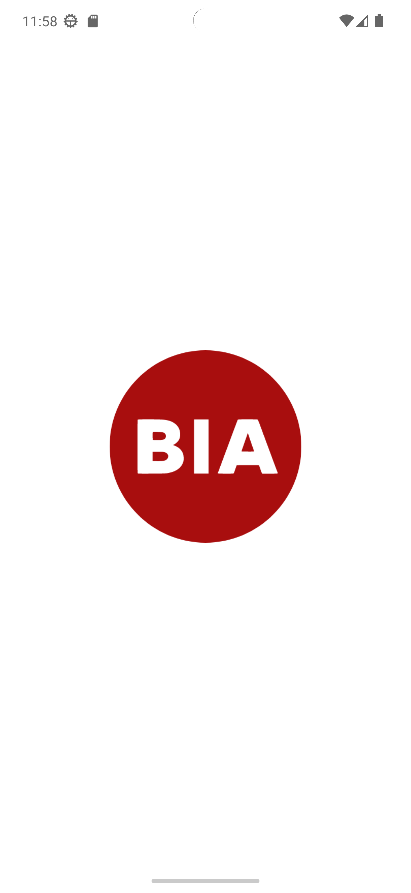
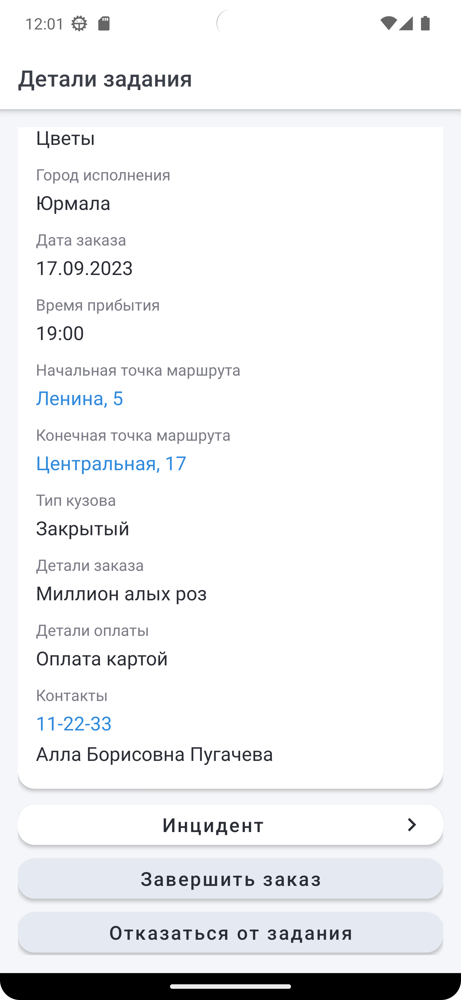
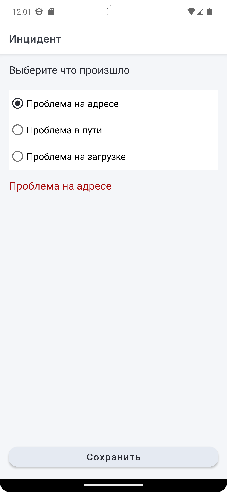
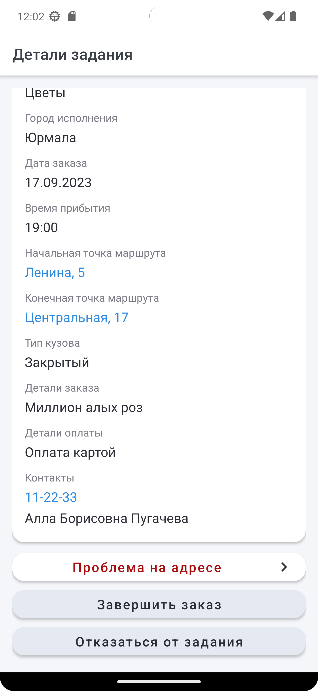
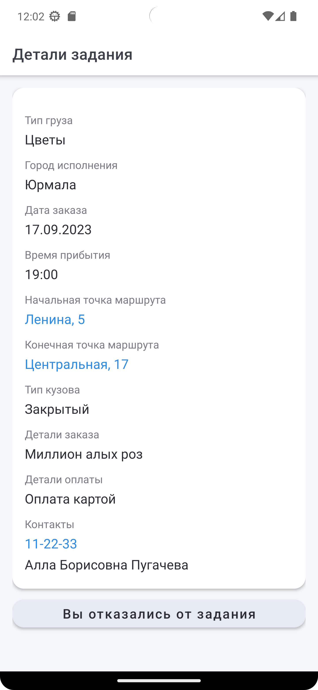

## BiaApp

**Реализовано:**

- заставка

- лента заданий, переход на детали выбранного задания по клику

            

- регистрация инцидентов при выборе задания, отказ от выполнения задания

            

- Использована архитектура MVVM
- Библиотеки Room, Coroutines, Recyclerview, Navigation, Hilt
